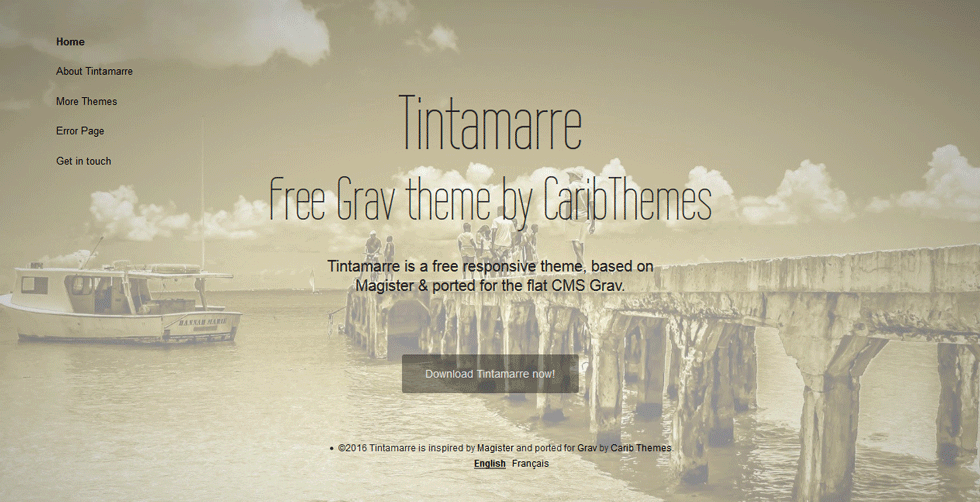

# Tintamarre Theme for the CMS Grav

> **Tintamarre** is a **FREE** minimalist responsive Theme ported by [**CaribThemes**](http://caribthemes.io) for the [**Grav**](http://getgrav.org) CMS and inspired by Magister by Sergey Pozhilov.

##### Table of Contents:

* [Demo](#demo)
* [Features](#features)
* [Installation](#installation)
* [Updating](#updating)
* [Setup](#setup)
* [Demo Content](#demo-content)
* [Showcase](#showcase)
* [Support & Bugs](#support--bugs)
* [Credits](#credits)

## Demo

See the **Tintamarre** Template live [here](http://caribthemes.io/demo/tintamarre)

## Features
* Fully Responsive
* HTML5 and CSS3
* Contact Form
* Multilingual ready - (demo in :uk: & :fr:)
* Custom Error page

## Installation

### Basic Setup for a new Grav site

The simplest way to install Tintamarre Theme for Grav is to download and install the Tintamarre Skeleton package:

* Download [Tintamarre Skeleton on Grav](http://getgrav.org/downloads/skeletons#extras) or the latest release on [GitHub](https://github.com/CaribThemes/grav-skeleton-tintamarre/releases).
* Simply unzip the package into your web root folder.
* Point your browser at the folder, job done!

> TIP: Check out the general [Grav installation instructions](http://learn.getgrav.org/basics/installation) for more details on this process.

### Existing Grav site

Installing the **Tintamarre** Theme can be done in one of two ways. Via GPM (Grav Package Manager) installation method enables you to quickly and easily install the theme with a simple terminal command, while the manual method enables you to do so via a zip file.

#### GPM Installation

The simplest way to install this theme is via the [Grav Package Manager (GPM)](http://learn.getgrav.org/advanced/grav-gpm) through your system's Terminal (also called the command line). From the root of your Grav install type:

    bin/gpm install tintamarre

This will install the Tintamarre Theme into your `/user/themes` directory within Grav. Its files can be found under `/your/site/grav/user/themes/tintamarre`

>> **NOTE:** for the Skeleton version, please see: [Skeleton](https://github.com/CaribThemes/grav-skeleton-tintamarre) - __TO COME__

#### Manual Installation

To install this theme, just download the zip version of this repository and unzip it under `/your/site/grav/user/themes`. Then, rename the folder to `tintamarre`. You can find these files on [GitHub](https://github.com/CaribThemes/grav-theme-tintamarre).

You should now have all the theme files under

    /your/site/grav/user/themes/tintamarre

>> NOTE: This theme is a modular component for Grav which requires the [Grav](http://github.com/getgrav/grav), [Error](https://github.com/getgrav/grav-theme-error) and [Problems](https://github.com/getgrav/grav-plugin-problems) plugins.

## Updating
As development for the Tintamarre Theme continues, new versions may become available that add additional features and functionality, improve compatibility with newer Grav releases, and generally provide a better user experience. Updating Grav is easy and can be done through Grav's GPM system, as well as manually.

#### GPM Update (Preferred)

The simplest way to update this theme is via the [Grav Package Manager (GPM)](http://learn.getgrav.org/advanced/grav-gpm). You can do this with this by navigating to the root directory of your Grav install using your system's Terminal (also called command line) and typing the following:

    bin/gpm update tintamarre

This command will check your Grav install to see if your Tintamarre Theme is due for an update. If a newer release is found, you will be asked whether or not you wish to update. To continue, type `y` and hit enter. The theme will automatically update and clear Grav's cache.

#### Manual Update

Manually updating Agency is pretty simple. Here is what you will need to do to get this done:

* Delete the `your/site/user/themes/tintamarre` directory.
* Download the new version of the Bootstrap Theme on [GitHub](https://github.com/CaribThemes/grav-theme-tintamarre).
* Unzip the zip file in `your/site/user/themes` and rename the resulting folder to `tintamarre`.
* Clear the Grav cache. The simplest way to do this is by going to the root Grav directory in terminal and typing `bin/grav clear-cache`.

> Note: Any changes you have made to any of the files listed under this directory will also be removed and replaced by the new set. Any files located elsewhere (for example a YAML settings file placed in `user/config/themes`) will remain intact.

## Setup
If you want to set Tintamarre as the default theme, you can do so by following these steps:

* Navigate to `/your/site/grav/user/config`.
* Open the **system.yaml** file.
* Change the `theme:` setting to `theme: tintamarre`.
* Save your changes.
* Clear the Grav cache. The simplest way to do this is by going to the root Grav directory in Terminal and typing `bin/grav clear-cache`.

Once this is done, you should be able to see the new theme on the frontend. Keep in mind any customizations made to the previous theme will not be reflected as all of the theme and templating information is now being pulled from the **tintamarre** folder.

## Demo Content
You can find inside theme directory the folder `_demo` where you can find the example contents for your site. If the theme is one-page layout copy all files inside `_demo/pages` into your home page folder. For the other folders follow the same name.

## Showcase
You want to share your site build with Tintamarre?
Feel free to add your site here...

## Support & Bugs
* If you find bugs, please report them on [here](https://github.com/CaribThemes/grav-theme-tintamarre/issues)

## Credits
* [Grav](http://getgrav.org) by [RocketTheme](http://www.rockettheme.com). Licensed under [MIT](https://github.com/CaribThemes/grav-theme-tintamarre/master/LICENSE.md)
* Photos by MATsxm for [IDIM<em>web</em>.com](http://idimweb.com). Licensed under __BeerWare__ (see LICENSE)
* Inspired by the template Magister by [Sergey Pozhilov](http://pozhilov.com)

>> __DISCLAIMER__

>>Note that @Sandra97 has never been involved in the CSS excepted for having killed few _!important;_ :stuck_out_tongue:

[CaribThemes](http://caribthemes.io), free web resources is proudly brought to you by [IDIM<em>web</em>.com](http://idimweb.com)

